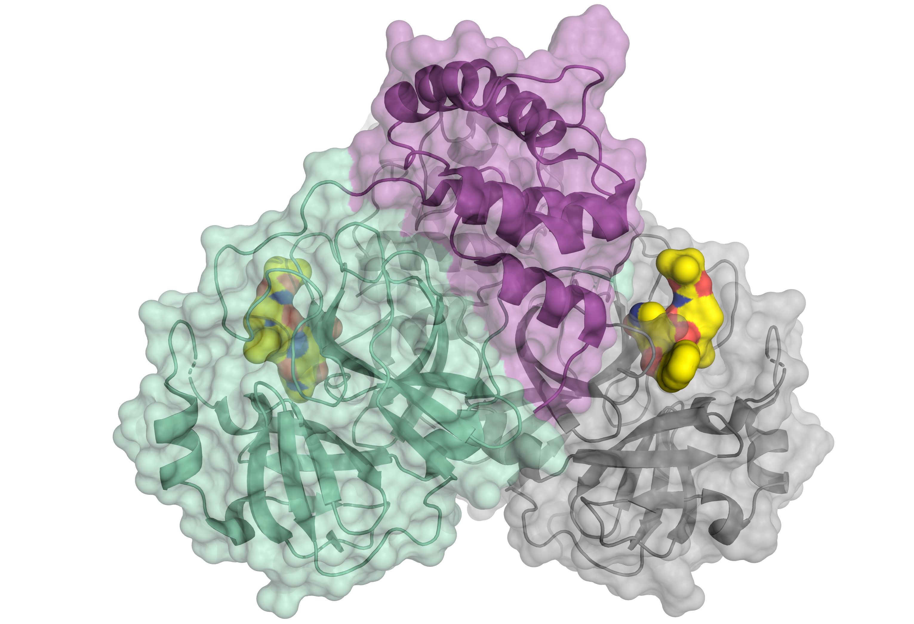
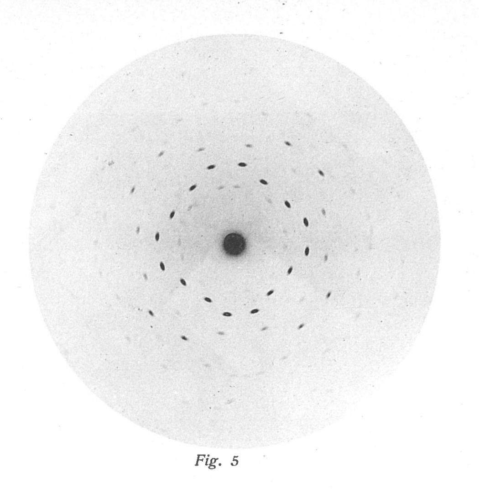

# Rendering Reality
Bild und Wirklichkeit in der Röntgenphysik

## Abstract
<!---Halbe Seite, Forschungsfrage und Untersuchungsgegenstand,
Relevanz und Innovation--->

Visualizations play an important role in scientific endeavours.
In the 1970s, sociologists and philosophers began to study the process of fact generation and also discussed the importance of images in this context, see e.g. .
Although the field has been growing, and more is known about the processes in scientific work, it hardly got any attention by scientists.
Since the widespread use of computers and the Internet, images have become even more important for knowledge transfer.
More powerful algorithms are available and digital images are generated faster. One consequence of this is that the boundary between data and images is becoming blurred .
At this point, Media Science can also contribute to a more holistic understanding of the role and use of images in science.

In the last decades it comes more and more into question how and if scientific knowledge can be truly objective .  
Objectivity has also come under criticism in Feminist Studies and new concepts have emerged.
As Donna Haraway puts it in her essay about situated knowledge , science tries to ''see everything from nowhere''.
Knowlege production is now more and more put into context, also beyond disciplines and beyond universities .
To take it a step further, one can ask about the general relation between science and society  and especially the role of images in science communication .

In this context I will also discuss state-of-the-art methods of experimental physics, which have not been addressed so far, e.g. 3D scanning with X-Ray flourescence .
A central aspect here is the difference between object and representation.
This difference manifests itself in three ways: first, through the uncertainty in measurement and analysis (error); second, through the relationship between measurement data and object; third, through the representativeness of the measured object.

Scince the standard for publications is still the Portable Document Format, modern forms of visualization hardly make it into the publications. 
Alternative ways of publishing are evolving. 
One example is distill, an online peer-reviewed journal where aricles are written for the web .

To demystify complex scientific knowledge and make the multi-layered process that precedes publication more tangible, Latour's chains of representation can be applied . 
By looking at all the steps in the evaluation pipeline, each transformation becomes traceable.
In each substep, the scientist has to make decisions and thus shapes the final result.
Especially in experiments where reconstruction algorithms are used or in 3D renderings of information, there is a lot of creative freedom in the (re)presentation.

Using X-ray physics as an example, I will explore how the visualization of research results plays out inside and outside of science, how ideas manifest themselves in it, and how images can contribute to effective communication but also to misinformation.

## Fragestellung
<!---
* Was genau ist die Problemstellung?
* Wo gibt es eine Forschungslücke?
* Warum sollte dieses Thema jetzt untersucht werden?
* Abgrenzung von Fragestellungen, die nicht untersucht werden
* Wissenschaftliche Relevanz 
* Anschluss an andere Forschungsdebatten
--->

Experimente in den Naturwissenschaften werden komplexer und die zugehörigen Daten nehmen immer mehr Platz auf den Festplatten von Forschungseinrichtungen ein. 
Diese enormen Datensätze können nur mit Hilfe von Algorithmen ausgewertet werden, wodurch Rechner eine immer wichtigere Rolle in den Wissenschaften, und damit in der Wissensproduktion, einnehmen.
In Publikationen werden in den seltensten Fällen Rohdaten gezeigt, üblicherweise durchlaufen die Messdaten einen längerem Prozess bei dem Selektion, Transformation und Visualisierung Anwendung finden.

In diesem Prozess gibt es an verschiedenen Stellen Spielräume, jeder Teilschritt der Datenauswertung kann auf verschiedene Weise umgesetzt werden.
Dabei geht es nicht unbedingt um ein normatives ''falsch'' oder ''richtig''. 
In jedem Falle aber sind Forschende dazu gezwungen, ihre Forschungsergebnisse zu gestalten. 
Dieser Gestaltungsprozess fängt beim Messaufbau an, setzt sich aber in Details wie der Skalierung, der Farbgebung eines Bilds, oder im Extremfall dem Rendering von dreidimensionalen Objekten fort.

<figure>
    
    © H. Tabermann/HZB">
    <figcaption>Schematische Darstellung der Coronavirus-Protease. © H. Tabermann/HZB</figcaption>
</figure>

In vielen Disziplinen haben sich über Jahrzehnte Standards für die Darstellung spezifischer Untersuchungsgegenstände etabliert.
Hier kann es sich um Atome und Moleküle, um Zellen, Galaxien, Oberflächenstrukturen von Platinen handeln.
Bei näherer Betrachtung stellt sich oft heraus, dass zwar die Form der Daten in zur Visualisierung passt, allerdings durch eine ''begreifbaren'' Form auch Eindrücke entstehen, die mit dem Untersuchungsgegenstand nichts mehr zu tun haben.

Ein Beispiel soll hier die Visualisierung der Coronavirus-Protease sein, siehe Abbildung. Beispiel ausführen!

### Repräsentation

Visualisierungen haben einen festen Platz in der Repräsentation von Systemen, der Planung experimenteller Aufbauten, Auswertung und Interpretation von Daten und der Modellbildung. 
In den wenigsten Fällen wird klar, welchen genauen Prozesse zur Herstellung eines Bildes durchlaufen werden, bevor sie sich als Ergebnis in Fachjournalen zeigen.
Hierbei lässt sich zwischen "erstellten" Grafiken, wie beispielsweise Diagrammen und Zeichnungen, sowie der direkten Darstellung von Messdaten unterscheiden.
Die Technologie der Photographie hat ermöglicht, Objekte abzubilden und somit Messungen auf Papier festzuhalten.
Im Falle einer photographischen Aufnahme ist relativ klar nachvollziehbar, wie sich Objekt und die Repräsentation zueinander verhalten.
Bei anderen in der Wissenschaft verwendeten Verfahren, bei denen Bilder als Messergebnisse auftreten ist diese Zuordnung weniger eindeutig.

<figure>
    
    <figcaption>Beugungsbild eines Kristalls aus Zinkblende (ZnS) </figcaption>
</figure>

Die ersten Schattenbilder die Ende des 19. Jahrhunderts von Wilhelm Conrad Röntgen aufgenommen wurden, lassen sich intuitiv deuten. 
Die "neue Art von Strahlen"  kann im Gegensatz zu sichtbarem Licht Materialien durchdringen und lässt so Rückschlüsse auf das innere des Körpers zu.
Ein großer Sprung in der Geschichte der Röntgenphysik war die Entdeckung von Beugung an Kristallen von Friedrich, Knipping und Laue . 
Diese neuartigen Beugungsexperimente erlaubten große Fortschritte in der Kristallographie, denn das Auflösungsvermögen von Röntgenstrahlung ist durch deren kurze Wellenlängen $$10^{-9} - 10^{-12}$$ Meter) in der Größenordnung der Gitterabstände.
Die Messergebnisse dieses Verfahrens sind aber bei weitem nicht mehr so leicht zu interpretieren wie Röntgens Schattenbilder.
Eines der ersten veröffentlichten Beugungsbilder ist auf Abb.zu sehen.
Direkte, intuitive Rückschlüsse auf den Beobachtungsgegenstand sind quasi unmöglich.
Für die Theorie zur Röntgenbeugung bekommt Max von Laue 1914 den Nobelpreis.
Seine Modelle machen es möglich, aus den Beugungsmustern auf Kristallstrukturen zurückzuschließen.

<figure>
    
    <figcaption>CDI XFEL</figcaption>
</figure>

Inzwischen können wir nicht nur periodische Strukutren -- Kristalle -- mittels Beugungsexperimenten untersuchen, sondern auch die Struktur einzelner, nanometergroßer Teilchen mit Röngentstrahlen untersuchen.
Das Verfahren zur linsenfreien Abbildung einzelner Nanopartikel mittels Diffratkion wurde 2002 von Sayre vorgeschlgen .
Hierbei werden einzelne Teilchen mit einem hochintensiven Röntgenlaser beschossen, siehe Abbildung.
Aus dem Beugungsbild lässt sich mittels Rekonstruktionsalgorithmen auf den zweidimensionalen Umriss des Teilchens schließen.
Über tausende Einzelschüsse kann durch dieses Verfahren auch auf die räumliche Ausdehnung geschlossen werden.

### Bild und Wirklichkeit

* Differenz zwischen Bild und Objekt
* Atlanten (Garsheys)
* Objektivität 
* Bilder als Teil der Wissensproduktion bei Jürgen Renn 
* The Power of Images in Early Modern Science. 

## Wissensproduktion im Kontext

In der Wissenschaftsforschung wird seit mehreren Jahrzehnten über die Rolle von Bildern in der Wissensproduktion publiziert .
Repräsentationsketten - Latour, Woolgar 

Im Kontext neuer Forschungspraktiken werden Bilder als  statt, vlg. 
Tatsächlich ist der Transfer in die Wissenschaften selbst bisher kaum gelungen.
Naturwissenschaftler:innen sind sich meist nicht über die Perspektiven aus den Geisteswissenschaften bewusst.

Sozialer Kontext, *Situated Knowledge*, Donna Haraway 
Informationsgeflecht - Deleuze, Guattari 
New Modes of Knowledge Production 
Bild und Objektivität in der Wissenschaft 

<figure>
    
    <figcaption> </figcaption>
</figure>

Neue Agenturen, die sich mit der Visualisierung von wissenschaftlicher Erkenntnis auseinandersetzten.

Art and Science. e.g. [Victoria Vesna](https://victoriavesna.com/) ,  [Eric Heller](https://interaliamag.org/interviews/eric-heller/),
Das Fraunhofer-Netzwerk [»Wissenschaft, Kunst und Design«](https://www.art-design.fraunhofer.de)

### Forschungslücke und Relevanz

Forschungslücke  
Systematische Untersuchung der Funktion und Rolle von Visualisierungen in der Wissenschaft, insbesondere in der Röntgenphysik.
Format von Visualisierungen in Veröffentlichungen.
Ausführung der Repräsentationskette an geeigeneten Beispielen.

Relevanz 
Experimente in der Forschung gewinnen Komplexität.
Sichtbarmachung erfolgt meist über Bilder.
Neue Arten der Sichtbarmachnug / Visualierung vefügbar (Bewegtbild, VR)
Bilder sind Schnittstelle für Nicht-Wissenschaftler:innen, Bilder wecken Interesse. 

## Forschungsstand
<!---
* Was wurde bisher untersucht?
* Welche Positionen existieren?
* Gibt es Kontroversen?
* Wie baut die Arbeit auf bestehendes auf, wie geht sie darüber hinaus?
* Zentrale Literatur und Thesen
* Wichtige Kontroversen --->

<figure>
    
    <figcaption>Röntgenbild der Hand des Anatomen Albert von Kölliker, aufgenommen im Physikalischen Institut der Universität Würzbug am 23. Januar 1896 von Wilhelm Conrad Röntgen</figcaption>
</figure>

* Pauwels L. Visual Cultures of Science: Rethinking Representational Practices in Knowledge Building and
Science Communication 
* Übersicht zur Rolle des Bildes in Technik und Wissenschaften: Das Technische Bild 
* Doktorarbeit Jochen Hennig über die Bildpraxis in der frühen Nanotechnologie 
* Emmison M., Smith P. und Mayall M. Researching the visual. Sage, 2012. 
* R. Adelmann u. a. Datenbilder. transcript-Verlag, 2015. 

**Die Rolle des Bildes in den Anfängen der Röntgenphysik**

Untersuchungen zu Bildern der Frühen Röntgenphysik "Durchleuchtung", Vera Dünkels

## Vorgehen und Methode
<!---
    \item Wie soll die Forschungsfrage beantwortet werden?
    \item Teilschritte
    \item Mögliche Einwände?
--->

tba

## Zeit- und Arbeitsplan

### Erstes Jahr (04/22 - 03/23)
Weiterntwicklung der Forschungsfrage
Recherche zu bestehenden Arbeiten im Forschungsfeld

### Zweites Jahr (04/23 - 03/24)

### Drittes Jahr (04/24- 03/25)

## Vorläufige Gliederung

1. The Role of Images in the Production of Knowledge
    1. Concepts and Definitions from Science Studies
    2. \textit{Object}ivity and Mode 2
    3. How Much Work do Scientific Images Do? 
    4. Visualization as Scientific Practice

2. Representation of Experimental Results in (X-Ray) Physics

    1. Typical Process of Measurement and Analysis
    2. Computers as Collaborators
    3. Chains of Representations 
    4. The Role of Design in Science
    5. Dealing with Uncertainty
    
3. Communication / Science and Society
    1. ''Science Image''
    2. Aesthetics and the Digital Realm
    3. (Un)Published Images
    4. New Forms of Visualization
    5. (Digital) Art and Scientific Knowledge

## Literature



[![CC BY-NC-SA 4.0][cc-by-nc-sa-shield]][cc-by-nc-sa]

[cc-by-nc-sa]: http://creativecommons.org/licenses/by-nc-sa/4.0/
[cc-by-nc-sa-shield]: https://img.shields.io/badge/License-CC%20BY--NC--SA%204.0-lightgrey.svg

