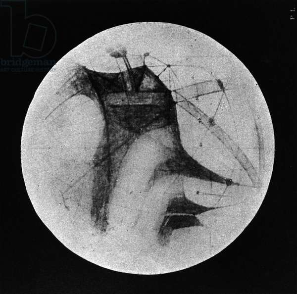

# Framework

I use different tools for this webpage. This is a short description of how and what I used. 

## Git(Hub)

All information is stored in a Git repository. [Git](https://en.wikipedia.org/wiki/Git) is a free and open source distributed version control system. Many small steps in the process get recorded and stored safely.

The whole repository is hosted via [GitHub](https://github.com/), a hub for open source developement. 

## Jekyll

[Jekyll](https://jekyllrb.com/) is a static site generator, that makes a webpage (html, css, javascript) from markdown flies.
All Github Pages are based on Jekyll. Unforturnatly many plugins are not allowed to use in Github Pages (like Jekyll Scholar). 

To avoid this restrictions, I set up my own deploy process via **Github Actions**. [This repo](https://github.com/jeffreytse/jekyll-deploy-action) was really useful to do this. It is necessary to set up a local pipeline (install Ruby etc.) for building the Jekyll site, but once it's done, the deployment via gh-actions and gh-pages is quite straight forward. Make sure, that the GITHUB_TOKEN has writing rights as well.

## Citations

For managing my library I use [Zotero](https://www.zotero.org/) in combination with [Better BibTeX](https://retorque.re/zotero-better-bibtex/)

For nice integration of citations on this page I use the plugin [Jekyll Scholar](https://github.com/inukshuk/jekyll-scholar). This is an example for a citation .



## three.js

[three.js](https://threejs.org/) is a cross-browser JavaScript library and application programming interface (API) used to create and display animated 3D computer graphics in a web browser using WebGL. 

  

To embed a three.js canvas, it is necessery to have a html container for the canvas and to embed the script.



  

 



In the javascript file, one has to refer to the canvas-holder, also in the renderer.


var canvasHolder = document.getElementById('canvas-holder');
const renderer = new THREE.WebGLRenderer( { antialias: true} ); //, alpha: true
renderer.setSize( width, height );
renderer.setAnimationLoop( animation );
canvasHolder.appendChild( renderer.domElement );


Full [javascript file](cube.js).

References that were useful:
* [use-three-js-in-jekyll-blog](https://y7k4.github.io/2020/10/02/use-three-js-in-jekyll-blog-1.html)
* [jekyll-threejs](http://longqian.me/2017/02/06/jekyll-threejs/)

## Images

I use an image container, which is styled via css.



<figure>
    
    <figcaption>Drawing of Mars showing 'canals' and dark areas. From Percival Lowell, London 1896. Foto Credit
Universal History Archive/UIG / Bridgeman Images</figcaption>
</figure>




.image-container {
  padding: 10px;
  width: 80%;
  align-content: center;
}
figcaption {
  font: italic smaller sans-serif;
  text-align: center;
}


<figure>
    
    <figcaption>Drawing of Mars showing 'canals' and dark areas. From Percival Lowell, London 1896. Foto Credit
Universal History Archive/UIG / Bridgeman Images</figcaption>
</figure>

## Videos

I use a video container, which is styled via css.



<iframe src="https://www.youtube.com/embed/LhfCietvDZo" allowfullscreen></iframe>




.iframe-container {
  overflow: hidden;
  /* 16:9 aspect ratio */
  padding-top: 56.25%;
  position: relative;
  margin-top: 2em;
}

.iframe-container iframe {
  border-width: 0px;
  margin: auto;
   height: 100%;
   left: 0;
   position: absolute;
   top: 0;
   width: 100%;
}


<iframe src="https://www.youtube.com/embed/LhfCietvDZo" allowfullscreen></iframe>

