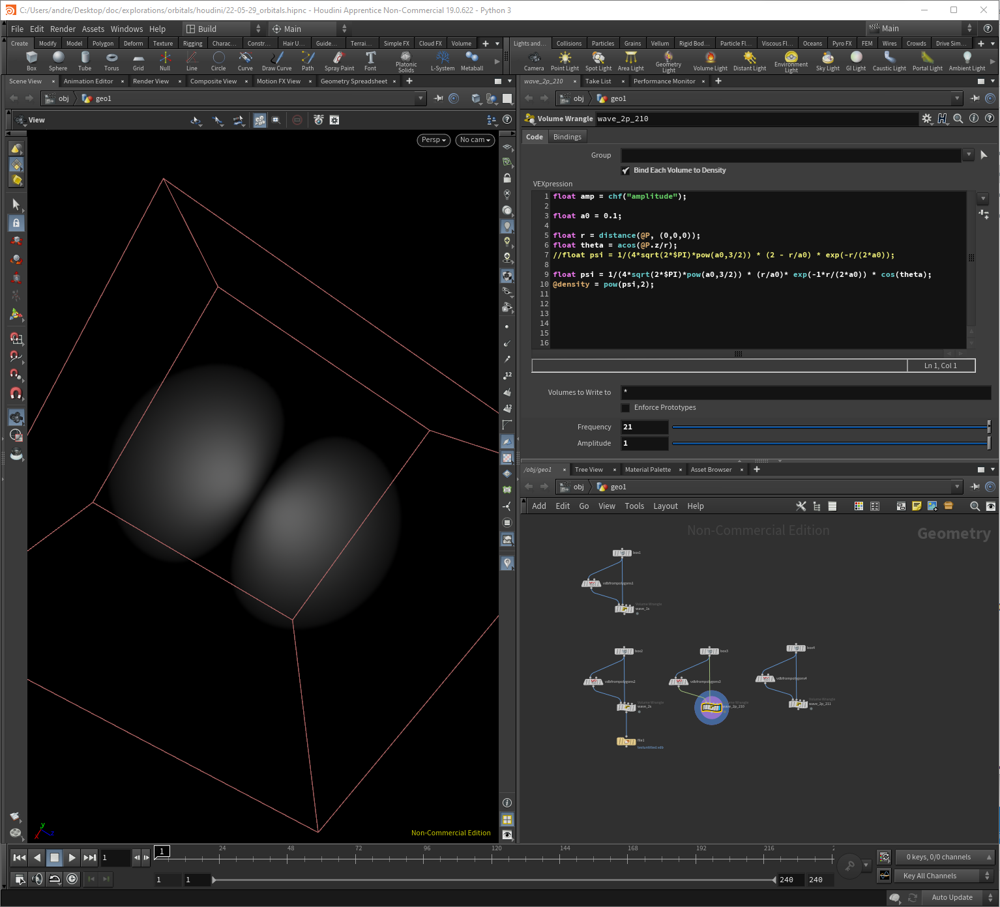

# Computer Graphics

This is an overview of tools and techniques I use to visualize.
I am especially interested in [volumetric rendering](https://en.wikipedia.org/wiki/Volume_rendering).
The smallest unit here is the voxel - the 3D complement of the 2D pixel.

## 3D Software

### Houdini

[Houdini](https://www.sidefx.com/products/houdini/) is a 3D animation software application developed by Toronto-based SideFX.
It is a powerful tool that can be used to produce different effects such as complex reflections, animations and particles system.

<figure>
    
    <figcaption>The Houdini user interface. Displayed is a foggy structure resembling a p orbital.</figcaption>
</figure>

For the start, I built a donut following [Houdini isn't scary](https://www.sidefx.com/tutorials/houdini-isnt-scary-part-1-basics/).
In the tutorial, one uses geometries to create objects, a solver for the dynamics (adding gravity), materials (shaders) for the surfaces, and last but not least a camera an a light.
When you got this, the render pipeline is complete and it is possible to generate images / videos like this:  
[will be added soon!].

#### References

* 
* [Houdini for Astronomy](http://www.ytini.com/)
* [Houdini for Mathematicians](http://wordpress.discretization.de/houdini/)
* [Geometry Processing and Applications WS19](http://wordpress.discretization.de/geometryprocessingandapplicationsws19/)

## 3D Formats

* [OpenVDB](https://www.openvdb.org/)

## Active Research

* [Scientific Computing and Imaging Institute](http://www.sci.utah.edu/), Utah; especially the [visualization design lab](https://vdl.sci.utah.edu/blog/)
* [AG Geometrie und Mathematische Physik](https://www.math.tu-berlin.de/arbeitsgruppen/ag_geometrie_und_mathematische_physik/mitarbeiter/), TU Berlin
* [Multi-Res](https://www.multires.caltech.edu/), Caltech

## Interesting Concepts

### Schrödinger Smoke [Paper](http://multires.caltech.edu/pubs/SchrodingersSmoke.pdf)

<iframe src="https://www.youtube.com/embed/5C9BLAXCe1I" allowfullscreen></iframe>

